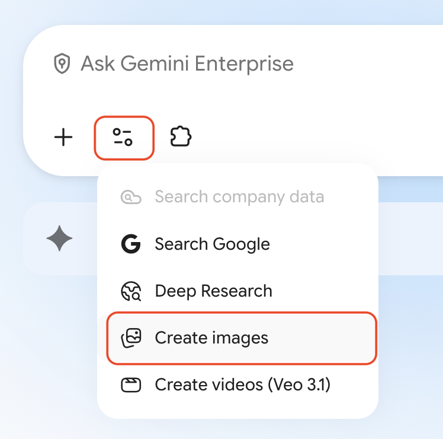
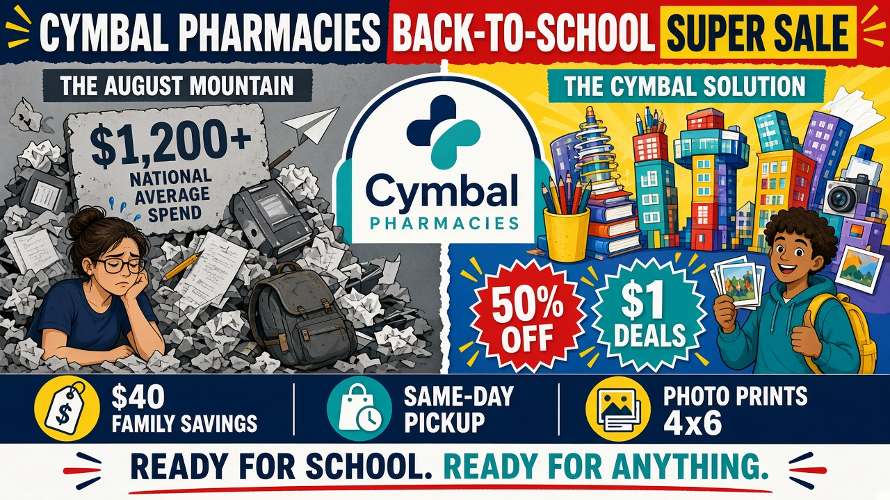

# Create a Back-to-School Infographic

## Overview

This lab takes about 20 minutes. You create a promotional infographic for Cymbal Pharmacies' Back-to-School Super Sale using Gemini's image generation model. You start with a strong baseline prompt, then iterate—adjusting style, fixing details, and tightening campaign copy—so the asset is ready for a merchandising huddle.

Cymbal Pharmacies is a national pharmacy retailer with neighborhood stores, a pharmacy counter in every location, and CymbalCare clinics in larger sites. Marketing and merchandising teams need campaign visuals that feel like a pharmacy, not a big-box school-supply aisle.

## Objectives

In this lab, you learn how to:

- Construct a detailed image generation prompt with role framing, visual metaphors, and specific campaign copy.
- Attach a brand logo as visual context for a generated asset.
- Iterate on a prompt by changing one or two elements at a time.
- Generate a branded promotional infographic grounded in real campaign details.

## Prerequisites

- Access to Gemini Enterprise with the images tool enabled.
- Comfort writing and editing short prompts.

## Setup

1. Sign in to Gemini Enterprise in your browser.
1. Start a new chat.
1. Keep this lab open so you can copy the logo and prompts.

## Task 1. Generate the baseline infographic

In this task, you give Gemini a campaign brief and the Cymbal Pharmacies logo, then generate the first infographic.

The Marketing team needs a horizontal infographic for the **Back-to-School Super Sale**. The brief: show the contrast between the stress of August spending and the relief a neighborhood pharmacy can provide. The asset must include school supplies, kids wellness items, photo prints, ExtraValue member savings, and the Cymbal Pharmacies logo.

<p align="left">
  
</p>

1. In the chat bar, select the **Tools** icon and choose the images tool.

<!-- TODO IMAGE: Gemini Enterprise chat bar with the Tools menu open and the images tool selected -->


1. Copy the Cymbal Pharmacies logo from this lab and paste it into the chat:

<p align="left">
  
  <br>
  <em>Cymbal Pharmacies logo</em>
</p>

1. Copy and paste the following prompt into the chat, then press Enter:

```text
You are a data visualization artist who creates infographics with dramatic, physical metaphors. Create a striking, horizontal infographic-style image promoting the "Cymbal Pharmacies: Back-to-School Super Sale."

The scene is a dramatic, split landscape. On the left side, labeled "THE AUGUST MOUNTAIN," stands a massive, precarious, towering pile of crumpled homework, worn-out backpacks, broken pencils, empty first-aid boxes, and dull grays. A sign on this pile reads: "$1,200+ National Average Spend (2025)." A cartoon parent below looks overwhelmed and exhausted, shielding their eyes.

On the right side, labeled "THE CYMBAL SOLUTION," the same mountain has been replaced by a sprawling, organized neighborhood made entirely of fresh, colorful school supplies, kids vitamins, first-aid kits, and photo-print envelopes. Notebook skyscrapers, pencil-case buses, and a small CymbalCare clinic kiosk gleam with primary colors. An energetic student wearing a "Cymbal Approved" backpack runs toward the scene, pulling a wagon stacked with glowing deals labeled "50% OFF" and "$1 BACK-TO-SCHOOL DEALS."

A large, friendly Cymbal Pharmacies logo is integrated seamlessly as the central archway entrance. Along the bottom, clean data callouts read: "$40 ExtraValue Family Savings," "1,000+ Items Under $5," and "Same-Day Store Pickup and 4x6 Prints." The final banner text across the bottom reads: "Cymbal Pharmacies: Ready for School. Ready for Anything."

See the attached image for the official Cymbal Pharmacies logo.
```

1. Review the output. Note what worked well and what you would change: logo accuracy, readable text, split-scene balance, and whether the scene still feels like a pharmacy.

<p align="left">
  
  <br>
  <em>Example result. Your image will differ. Watch for misspellings in generated text, such as a mistyped brand name.</em>
</p>

> [!TIP]
> Generated text in images is often the weakest part of the first pass. If the logo or tagline is wrong, treat that as the first thing to fix in Task 2 rather than regenerating the entire concept.

## Task 2. Iterate to improve the result

In this task, you practice prompt engineering for images by changing one or two things at a time.

Try at least two of the following refinements:

1. **Adjust the style.** Add a style instruction to the end of the original prompt, for example:

```text
The style should be a bold, flat vector illustration with thick outlines, similar to a children's book or modern editorial design.
```

1. **Fix a specific element.** Isolate one problem instead of rewriting the whole brief:

```text
Regenerate the image. Keep everything the same but move the Cymbal Pharmacies logo to the upper-right corner, spell the brand name exactly as Cymbal Pharmacies, and make the tagline text larger and easier to read.
```

1. **Change the campaign.** Swap Back-to-School for a **flu season** version. Replace the mountain metaphor with a crowded waiting room versus a calm CymbalCare immunization lane. Update the callouts to flu shot walk-in hours, ExtraValue member pricing, and same-week appointments.

> [!NOTE]
> Each iteration should change only one or two things at a time. Changing everything at once makes it hard to understand what improved the result.

### Success criteria

- The image is horizontal and reads as a campaign infographic, not a random store photo.
- The Cymbal Pharmacies name is spelled correctly.
- You can explain which prompt change improved the second or third version.

## Task 3. Create an infographic for your own campaign

In this task, you transfer the same pattern to a campaign you actually care about.

1. Start a new chat and attach the Cymbal Pharmacies logo, or a logo from your own work if your instructor allows it.
1. Write a prompt that includes a role, a visual metaphor, specific prices or offers, and a tagline.
1. Generate the image, then run one focused refinement.

> [!NOTE]
> Good pharmacy-retail ideas include a vaccination weekend, a photo-center promotion, a diabetes-awareness endcap, or a caregiver wellness event.

## Congratulations!

You generated a branded Back-to-School infographic for Cymbal Pharmacies, iterated with focused prompt changes, and applied the same pattern to a campaign of your own. You can reuse this workflow any time Marketing needs a first-pass visual before a designer takes over.
