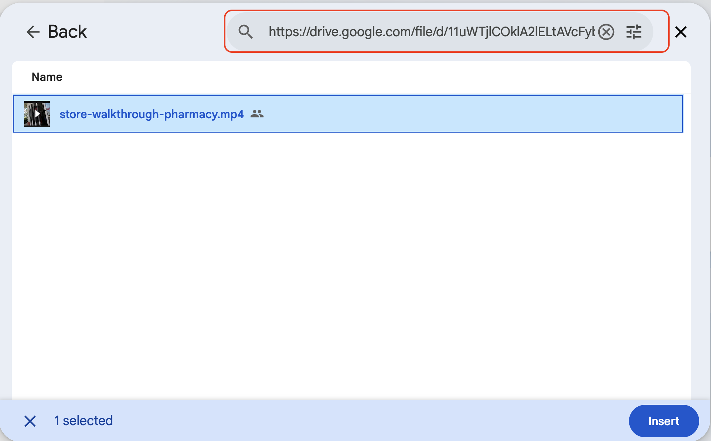

# Analyze a Store Walkthrough Video

## Overview

A regional manager just submitted a walkthrough video from Cymbal Pharmacies Store 2482. Store Operations needs to know whether the store meets company merchandising and pharmacy standards before Friday's district huddle, and nobody has time to drive out and look.

In this lab, you give Gemini the video and the standards checklist together. Gemini produces a timestamped audit with cited standards sections, and you turn the top findings into a corrective action note for the store manager.

## Objectives

In this lab, you learn how to:

- Upload and analyze a video file with Gemini.
- Provide a standards checklist as grounding context for video analysis.
- Ask Gemini to produce structured, timestamped findings from unstructured video.
- Turn audit findings into a manager-ready corrective action note.


## Task 1. Upload the video and run the audit

In this task, you give Gemini both the standards and the footage, then request a formal audit.

Store 2482 sits next to a high school, so the Back-to-School endcaps and the pharmacy waiting area both matter here.

<p align="left">
  
</p>

1. Sign in to Gemini Enterprise (or the Gemini app) and start a new chat.

2. Click **+ Add from Drive** and paste the following URL to a video file of a pharmacy store walkthrough:

```
https://drive.google.com/file/d/11uWTjlCOklA2lELtAVcFyb85Vp71A0ka/view?usp=sharing
```



3. Copy and paste the standards checklist below into the same chat. Do not press Enter yet.

```text
CYMBAL PHARMACIES
Visual Merchandising and Store Standards
Version 2025.3 | Applies to all neighborhood stores
Document owner: Field Merchandising and Store Operations

SECTION 1. CUSTOMER PATH AND SAFETY
1.1 Aisles must remain clear of cases, pallets, and restock carts during open hours.
1.2 Floor hazards (spills, torn mats, loose cables) must be corrected immediately.
1.3 Emergency exits and fire extinguishers must be visible and unblocked.
1.4 Entrance doors must show current store hours, pharmacy hours, and CymbalCare hours when a clinic is on site.

SECTION 2. FRONT-SHOP MERCHANDISING
2.1 Endcaps must match the current planogram. Seasonal themes may not mix with leftover prior-season signing.
2.2 Price labels must be present, aligned, and match the shelf product in front of them.
2.3 Out-of-stocks on advertised Back-to-School or seasonal items must show a void tag and a substitute location when one exists.
2.4 Impulse fixtures at checkout must be fully faced and free of overstock stacked on top.

SECTION 3. PHARMACY AND CLINIC EXPERIENCE
3.1 The pharmacy waiting area must have clear queue signage and an unobstructed path to the consultation window.
3.2 Protected health information (prescriptions, labels, patient notes) must not be visible to customers in line.
3.3 The consultation window must be staffed or show a "pharmacist with next patient" wait-time card.
3.4 Immunization and CymbalCare posters must show the current season and a working booking method.

SECTION 4. PRODUCT INTEGRITY
4.1 Refrigerated and frozen cases must be closed, in temperature range, and free of expired units in the front row.
4.2 Over-the-counter medicines and infant products must be in date and faced to the front of the shelf.
4.3 Damaged, crushed, or open packages must be pulled from the sales floor.

SECTION 5. BRAND AND SIGNING
5.1 Only current Cymbal Pharmacies and ExtraValue signing may be used. Handmade or faded signs must be removed.
5.2 Windows and door decals must be clean and limited to approved campaigns.
5.3 The pharmacy shield and CymbalCare mark must be lit and unobstructed during open hours.
```

4. Below the standards checklist, copy and paste the following prompt, then press Enter:

```text
Role: You are the Primary Store Standards Manager for Cymbal Pharmacies, conducting a formal virtual audit of Store 2482.

Task: Analyze the provided store walkthrough video. Identify every instance of non-compliance with the Cymbal Pharmacies Visual Merchandising and Store Standards text pasted in this chat.

Instructions:
- Cross-reference: For every finding, cite the specific standards section (for example, "Violation of Section 2.1: Endcaps must match the current planogram").
- Evidence: Provide the exact timestamp from the video where each finding occurs.
- If the camera never shows a required area, list that as Unable to verify rather than inventing a violation.

Output format:
1. Audit Log — a chronological list of findings, each with: [Timestamp] | [Category] | [What you saw] | [Standards Section] | [Severity: Critical, Moderate, or Cosmetic]
2. Critical Risk Summary — the top 3 issues that should be fixed before the next business day, with a brief explanation of why each is high priority.
3. Operational Recommendations — brief, actionable suggestions for the Store Manager to prevent recurrence.

Use only the video and the standards text. Do not invent store conditions that are not visible.
```

5. Review the output. For at least two findings, jump to the timestamp in the video and confirm that Gemini described what is actually on screen.

> [!TIP]
> If Gemini writes a long narrative instead of the audit table, reply: "Reformat the Audit Log as a markdown table with the columns requested."

### Success criteria

- The response includes timestamps and standards section numbers.
- At least one finding matches something you can see in the video.
- Areas the camera never shows are marked Unable to verify, not listed as violations.

## Task 2. Drill down on a specific finding

In this task, you use follow-up prompts to turn a generic audit into something a store team can act on today.

1. Pick one finding from the Audit Log and ask:

```text
For the finding at 00:23 - 00:25, what specific corrective action should the store associate take, which role owns it (front-shop lead, pharmacist in charge, or store manager), and how long should it realistically take to fix during open hours?
```

2. Ask Gemini to reprioritize the findings for a different audience:

```text
Re-rank all findings by customer experience risk rather than chronological order. Which three are most likely to cause a complaint, a wait-time spike, or a privacy issue today?
```

3. Ask one pharmacy-specific follow-up even if the video is mostly front-shop:

```text
Based only on what is visible, what can you say about the pharmacy waiting area, consultation window, and immunization signing? If the video does not show those areas, say so and list the three shots a district leader should capture on the next walkthrough.
```

## Task 3. Draft the store manager note

In this task, you convert the audit into a short note a district leader would actually send.

1. Paste the following prompt:

```text
Draft a concise corrective action note from the District Leader to the Store Manager of Store 2482.

Requirements:
- Reference only the top 3 critical findings from the audit.
- For each finding, include the timestamp, the standards section, the required fix, and a 48-hour due date.
- Request a photo of each completed fix.
- Keep the tone firm, specific, and respectful. Do not threaten termination.
- End with one sentence offering help if the store needs a reset kit or extra hours.
```

2. Review the draft. Would you send it as-is? Edit anything that overstates a finding or cites a section the video did not support.

## Task 4. Try the same method on your own video

In this task, you transfer the workflow to footage you control.

1. If time allows, record a 30-to-60-second clip of a public retail space, a training store, or a staged shelf in the classroom. Do not record patients, prescriptions, or any protected health information.
2. Start a new chat, upload the clip, paste a short checklist you write yourself, and ask for a timestamped audit.

> [!WARNING]
> Do not film real patients, prescription labels, or identifiable health information. If the instructor video includes a pharmacy counter, treat any visible paperwork as out of scope and ask Gemini to ignore it.

## Congratulations!

You grounded a store walkthrough in Cymbal Pharmacies standards, produced a timestamped audit, and turned the top findings into a district note. The same pattern works for planogram checks, seasonal resets, and clinic readiness reviews.
