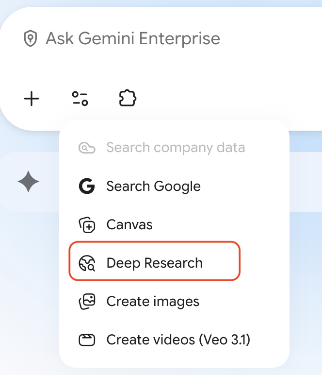

# Run Competitive Deep Research

## Overview

Cymbal Pharmacies leadership wants to know who is winning the trips that happen outside the pharmacy counter: retail clinics, prescription delivery, immunizations, and membership pricing. The two competitors they ask about most are Walgreens and Rite Aid. Strategy has one morning to answer.

In this lab, you use Deep Research to investigate both companies, narrow the findings to the services that pull trips away from Cymbal stores, and write a cited note for leadership.

<p align="left">
  
</p>

## Objectives

In this lab, you learn how to:

- Frame a strong Deep Research request with a role, two named competitors, and a required output.
- Review and adjust a research plan before the run starts.
- Ask follow-up questions that improve source quality and specificity.
- Turn multi-pass research into a concise, decision-ready strategy note.

## Task 1. Start with a broad competitive brief

In this task, you ask Deep Research for a company-level picture of both competitors. You narrow it to specific services in Task 2.

<p align="left">
  
</p>

1. Sign in to Gemini Enterprise (or the Gemini app) and start a new chat.

2. From the **Tools** list, select **Deep Research**.



3. Paste the following prompt:

```text
You are helping Cymbal Pharmacies, a national neighborhood pharmacy retailer with CymbalCare clinics and ExtraValue membership pricing, evaluate two competitors: Walgreens and Rite Aid.

Research Walgreens and Rite Aid and summarize the facts a retail-pharmacy strategy team needs.

For each company, return:
1. What the company sells in pharmacy, retail, clinics, and delivery
2. How it makes money and which segments appear to matter most
3. The customer problem it claims to solve better than a neighborhood pharmacy
4. The top 3 signs it is a serious threat to Cymbal Pharmacies
5. The top 3 reasons Cymbal should not overreact

Then return:
6. A short comparison of Walgreens versus Rite Aid
7. A one-sentence preliminary take for the Chief Pharmacy Officer

Use reliable public sources and cite where each claim comes from. Do not invent store counts, financials, or clinical outcomes. Label unverifiable claims as Unverified.
```

4. Wait for Deep Research to generate a research plan. A useful plan should cover both companies' pharmacy offers, adjacent services (clinics, delivery, membership), recent news, and risks.
5. If the plan is only company history, ask it to add retail clinics, immunizations, and last-12-month news for both Walgreens and Rite Aid before you continue.
6. Scroll to the bottom of the plan and click **Start research**.

> [!NOTE]
> Deep Research can take several minutes.

## Task 2. Focus on services that steal pharmacy trips

In this task, you narrow the research from company overviews to the Walgreens and Rite Aid offers that actually change Cymbal store traffic.

1. Ask a follow-up focused on services, not biography:

```text
Now focus only on the Walgreens and Rite Aid services that could pull prescriptions, immunizations, or front-shop trips away from a neighborhood pharmacy like Cymbal Pharmacies.

Research each company for:
1. Clinic or virtual-care offer, if any
2. Prescription delivery, mail, or same-day pickup
3. Immunization walk-in or appointment model
4. Membership, insurance, or cash-pay pricing programs
5. Any school-season, caregiver, or photo/retail adjacency that drives trips

Return a table with Company, Service, How it works, Evidence, and Implication for Cymbal Pharmacies.
Use only evidence you can support from reliable sources. Label gaps as Unverified.
```

2. Check whether the output names specific programs, dates, or geographies rather than "they have clinics." If it is vague, ask:

```text
For each service, cite a specific program name, date, geography, or pricing example. If you cannot verify it, move it to Unverified and do not present it as fact.
```

## Task 3. Test the market, not just the company

In this task, you zoom out to the retail pharmacy market so the note is not only a Walgreens and Rite Aid profile.

1. Ask a market-focused follow-up:

```text
Research the U.S. retail pharmacy and retail clinic market as it affects Cymbal Pharmacies.

Answer as a strategy lead would.

Return:
1. The customer problems that are changing now (access, price, convenience, trust)
2. Market direction for drugstore chains, mass retail pharmacies, and digital pharmacies
3. The most important competitors or alternatives besides Walgreens and Rite Aid
4. Where a neighborhood pharmacy plus clinic model can still win
5. The biggest market risk for Cymbal Pharmacies in the next 12 to 24 months
6. Whether Cymbal should treat this as a clinic fight, a delivery fight, a price fight, or a local-trust fight
```

2. If market-size claims appear without a source, ask:

```text
Replace any general market size claims with specific figures or named sources. If a number cannot be verified, label it Unverified.
```

## Task 4. Produce a leadership note

In this task, you synthesize the research into something an executive can read before a staff meeting.

1. Ask Deep Research to write a short decision note:

```text
Prepare a short competitive note for Cymbal Pharmacies leadership using only the research gathered so far.

Write a memo with these sections:
- Title
- One-line summary
- Why Walgreens and Rite Aid matter
- How the two competitors differ from each other
- Where Cymbal is still stronger
- Key risks
- Missing information
- Recommended next step for Strategy and Pharmacy Operations

Rules:
- Stay grounded in the research.
- Do not invent facts.
- Mark uncertain claims as Unverified.
- Keep it concise and decision-oriented.
- Do not recommend illegal information gathering or anything that uses another company's confidential data.
```

2. If the recommendation is timid, ask:

```text
Rewrite the recommended next step so it is a real operating choice: monitor, pilot a matching offer in 20 stores, or decline to copy either competitor. Give a one-line rationale.
```

3. Skim citations. A leadership note is only useful if someone can click through the two or three claims that would change a budget.


### Success criteria

- The note names actual Walgreens and Rite Aid services, not only brand stories.
- At least two claims have citations you can open.
- Unverified items are labeled instead of being written as facts.

## Task 5. Point Deep Research at your own question

In this task, you reuse the method on a question from your role.

| Scenario | Example question |
|---|---|
| **Clinic capacity** | How are national retailers staffing retail clinics and immunizing pharmacists for the fall season? |
| **Cash pay** | How are transparent-pricing pharmacies changing customer expectations on common generics? |
| **Delivery** | What same-day prescription delivery options are national competitors advertising in major metro areas? |
| **Front-shop** | How are drugstore chains using seasonal campaigns to protect front-shop traffic? |

1. Open a new Gemini Enterprise chat and select **Deep Research**.
2. Write a prompt that includes your role, Cymbal Pharmacies context (or your real team), and the question. Ask for citations.
3. Adjust the plan if it is too broad, then start research.
4. Ask one follow-up that forces specifics. Be ready to share one finding with the group.

## Congratulations!

You used Deep Research to profile Walgreens and Rite Aid, narrowed the work to trip-stealing services, checked the broader market, and produced a leadership note with citations. That is the first-pass research pattern Strategy and Pharmacy Operations can reuse before a longer human analysis.
