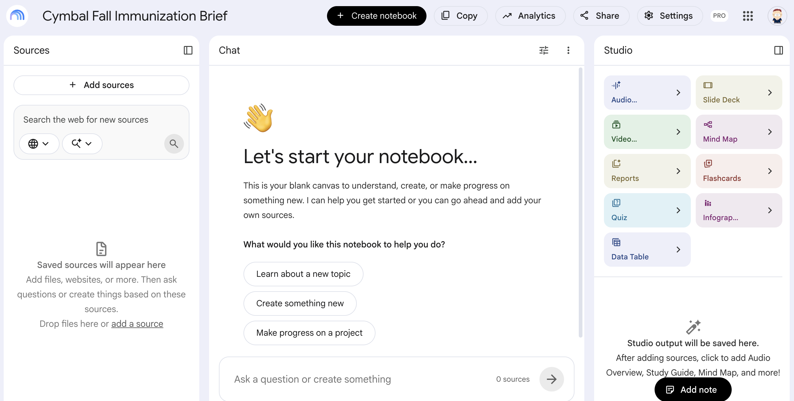
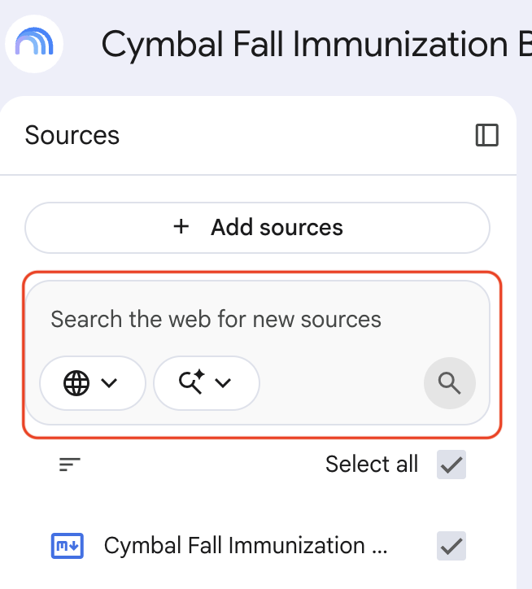
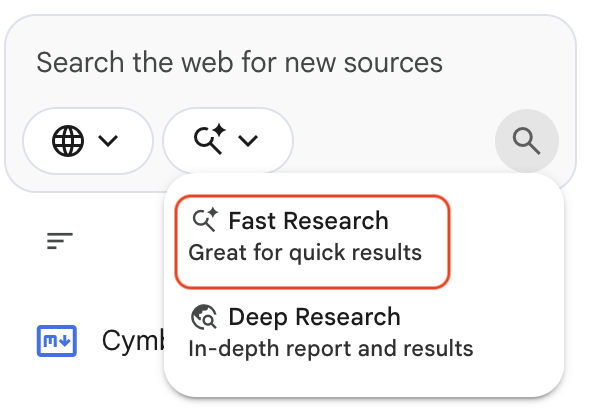

# Build a Competitive Brief in Gemini Notebook

## Overview

This lab takes about 30 minutes. You create a Gemini Notebook for Cymbal Pharmacies' fall immunization program, add an internal protocol as copied text, then use Notebook web search to pull live public sources. You ask questions that require both the internal brief and the web sources, and every answer should cite where it came from.

Clinical, compliance, and learning teams at Cymbal Pharmacies often sit between a private protocol and a fast-changing public landscape. Gemini Notebook is useful when you need grounded Q and A across those two worlds without emailing a folder of PDFs.

## Objectives

In this lab, you learn how to:

- Create a notebook and add an internal source as copied text.
- Use the Notebook Guide to get a structured overview of a source.
- Search the web from Gemini Notebook and add live sources.
- Ask questions that combine private internal data with public competitor and public-health sources.
- Save a short note you could drop into a leadership brief.

## Prerequisites

- A Google account that can open [Gemini Notebook](https://notebooklm.google.com/).
- No Google Drive files are required.

## Setup

1. Open [Gemini Notebook](https://notebooklm.google.com/) and sign in if prompted.
1. Keep this lab open. You will paste an internal brief and several search queries.

<p align="left">
  
</p>

## Task 1. Create the notebook and add the internal brief

In this task, you load the only private source in the notebook: Cymbal's own immunization campaign brief.

You are the Director of Clinical Programs at Cymbal Pharmacies. Leadership wants a two-week readout: can CymbalCare clinics and store-based immunizing pharmacists absorb fall demand, and how do public competitors talk about walk-ins, booking, and price? You have an internal brief. You do not yet have the public sources.

<p align="left">
  
</p>

1. On the Gemini Notebook home page, create a new notebook.
1. Close the **Add sources** screen if it blocks the notebook, then name the notebook `Cymbal Fall Immunization Brief`.

<!-- TODO IMAGE: New Gemini Notebook named Cymbal Fall Immunization Brief -->


1. In the **Sources** panel, click **+ Add sources**, select **Copied text**, paste the brief below, and click **Insert**:

```text
CYMBAL PHARMACIES — CONFIDENTIAL
Fall Immunization and CymbalCare Capacity Brief
Prepared for: Clinical Programs, Pharmacy Operations, and Store Operations
Date: September 8
Owner: Director of Clinical Programs

PROGRAM GOAL
Protect neighborhood access to influenza, COVID-19, and back-to-school required vaccines while keeping pharmacy ready-time at or below 15 minutes.

NETWORK
- 1,240 neighborhood stores with immunizing pharmacists
- 310 CymbalCare clinics (nurse practitioners) co-located in larger stores
- ExtraValue members: $5 off flu shot through September 30
- Non-members: standard posted cash price; insurance billed when eligible

CAPACITY SNAPSHOT (INTERNAL)
- Average flu-shot slots remaining this Saturday across District 14: 18 per store
- Stores near large high schools (including Store 2482): Saturday walk-in boards are clearing by 11 a.m.
- CymbalCare physicals and school-form visits are already 70 percent booked for the next 10 weekdays
- Immunizing pharmacist vacancy: 4 percent district-wide, 11 percent in District 14
- Last season's no-show rate for scheduled shots: 12 percent

PROTOCOL NOTES
- Standing order allows trained pharmacists to administer seasonal influenza vaccine to eligible patients per current CDC timing
- Pediatric vaccines outside standing-order age ranges route to CymbalCare or the patient's medical home
- Consultation window conversations must not be audible from the greeting-card aisle
- Stores may not handwritten-change vaccine prices on posters

KNOWN GAPS
- 22 percent of stores still display last season's immunization poster
- Same-day flu walk-in messaging is inconsistent on store door hours stickers
- Competitive walk-in and membership pricing is rumored but not verified in this brief
- No head-to-head internal study of ExtraValue $5 offer versus competitor cash prices

QUESTIONS LEADERSHIP WILL ASK
1. Are we a walk-in brand or an appointment brand this fall?
2. Which competitors are advertising no-appointment shots in our metro markets?
3. Does the ExtraValue $5 offer still look meaningful?
4. What should District 14 do this week about Saturday capacity?
```

1. After the source is added, rename it to `Cymbal Fall Immunization Capacity Brief`.
1. Read the Notebook Guide or chat overview. Confirm that Gemini identified the store network, ExtraValue offer, District 14 pressure, and the open leadership questions.

> [!NOTE]
> With only this source loaded, Gemini knows Cymbal's plan and nothing reliable about competitors or current public-health guidance. That changes in the next task.

## Task 2. Search the web and add live sources

In this task, you use Gemini Notebook's built-in web search so you do not copy links from a browser.

1. In the **Sources** panel, find **Search the web for new sources**.

<!-- TODO IMAGE: Gemini Notebook Sources panel showing the Search the web for new sources box -->


1. Open the research-mode dropdown next to the search box. Choose **Fast Research** for this lab. Use **Deep Research** only if your instructor wants a slower, more thorough pass.

<!-- TODO IMAGE: Research mode dropdown showing Fast Research and Deep Research -->


1. Run each search. After each one, review the suggested sources and add the most relevant results (or all of them).

**Search 1 — current public-health guidance:**

```text
CDC influenza vaccination recommendations current season timing
```

Look for CDC or other official public-health pages on who should be vaccinated and when the season starts.

**Search 2 — national drugstore competitor:**

```text
Walgreens flu shot walk-in appointment price
```

Look for booking pages, season announcements, and any stated walk-in or membership offer.

**Search 3 — mass-retail competitor:**

```text
Walmart Pharmacy flu shots and clinic services
```

Look for pharmacy immunization pages and any in-store clinic language.

**Search 4 — digital or cash-pay pressure:**

```text
Amazon Pharmacy prescriptions delivery membership
```

This source will not answer flu-clinic questions by itself. It is there so you can see how digital pharmacy changes customer expectations.

> [!NOTE]
> Prefer official public-health sites, company investor or help pages, and established news outlets. Skip random blogs when a primary page is available. You can add more sources later.

1. Your notebook should now contain the Cymbal internal brief plus live web sources.

## Task 3. Ask questions that need both kinds of sources

In this task, you ask questions no single source can answer well.

1. Start with a public-guidance question:

```text
According to the public-health sources in this notebook, who should receive an influenza vaccine this season and when should vaccination begin? How should Cymbal Pharmacies talk about timing in store without inventing clinical advice beyond those sources?
```

1. Ask a competitive comparison:

```text
Compare Cymbal Pharmacies' ExtraValue $5 flu-shot offer and Saturday walk-in pressure with what the Walgreens and Walmart sources say about booking, walk-ins, and price. Where is Cymbal clearly different, and where is the public evidence too thin to claim a win?
```

1. Ask an operations question that uses the internal brief:

```text
Using the Cymbal capacity brief and the competitor sources, what should District 14 do this week about Saturday immunization capacity at school-adjacent stores? Give three actions and label anything that depends on unverified competitor claims.
```

1. Ask a gap question:

```text
Based on the sources in this notebook, what is the single most important question Cymbal leadership will ask that the current sources cannot yet answer?
```

> [!NOTE]
> A question the notebook cannot fully answer is useful. It tells you what still belongs in a human phone call or a store visit.

1. Deselect the Cymbal internal brief and re-ask the District 14 question. The answer should get weaker or more generic. That is how you confirm the internal source was doing real work.

## Task 4. Save a note for the leadership readout

In this task, you capture a paragraph you could paste into a slide.

1. Ask:

```text
Write a one-paragraph Competitive and Capacity Summary for the first page of the Cymbal Pharmacies fall immunization readout. Use only notebook sources. Cite the public sources in plain language. Do not invent prices or store counts.
```

1. Save the paragraph as a note in the notebook.
1. If a sentence is not backed by a source, delete it or ask Gemini to rewrite with citations only.

### Success criteria

- The notebook contains the internal brief and at least three web sources.
- Answers to Task 3 questions include citations you can open.
- The saved note does not invent competitor prices that were not in a source.

## Task 5. Try the pattern on your own topic

In this task, you build a second, smaller notebook for a problem from your role.

1. Create a new notebook.
1. Paste a short internal memo as copied text. It can be fictional or a sanitized version of real work.
1. Run two Fast Research queries on a competitor, a regulation, or a clinical guideline.
1. Ask one question that requires both the internal text and the web sources.

Good pharmacy-retail topics include cash-pay generics, retail-clinic staffing, photo-center seasonal offers, or a new immunization schedule.

## Congratulations!

You built a Gemini Notebook that holds Cymbal Pharmacies' internal immunization brief beside live public sources, asked cited questions across both, and saved a leadership paragraph. That is the research workspace pattern clinical, compliance, and operations partners can reuse when the protocol and the public story must stay connected.
