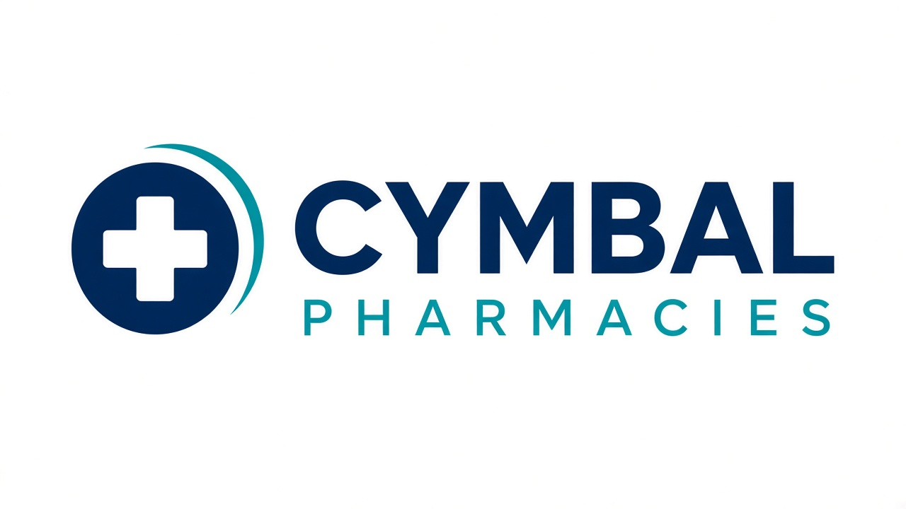
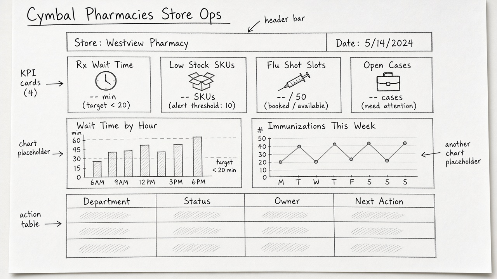
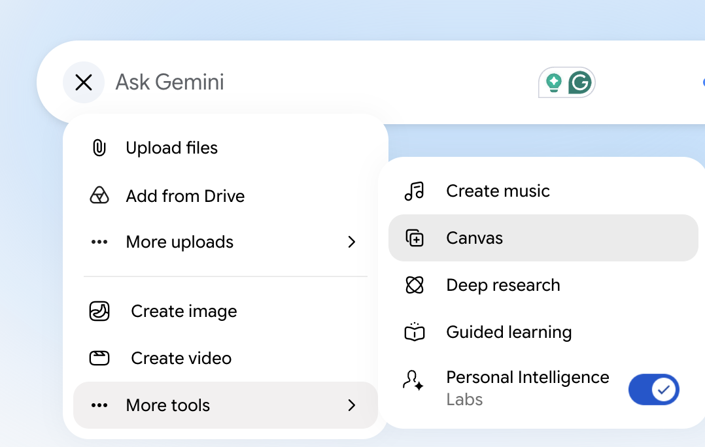
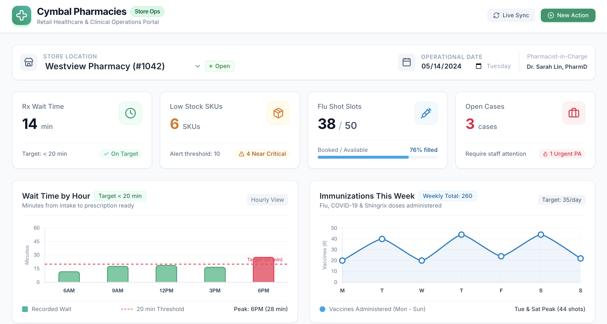

# Vibe Code a Store Operations Dashboard with Canvas

## Overview

This lab takes about 30 minutes. You turn a rough dashboard sketch into a working page shell with Gemini Canvas, then refine the layout with focused follow-up prompts. You are not building a production app. You are learning how store and district leaders can go from a whiteboard to something clickable in one sitting.

Cymbal Pharmacies district managers watch four numbers before they call a store: pharmacy wait time, low-stock SKUs, immunization slots, and open cases. A simple dashboard beats a stack of spreadsheets when the huddle starts in ten minutes.

## Objectives

In this lab, you learn how to:

- Translate a low-fidelity UI sketch into a structured web layout.
- Use Gemini Canvas to generate a dashboard shell from an image and a short prompt.
- Compare a vague prompt with a tighter prompt that stays faithful to the sketch.
- Refine a generated interface with focused follow-up prompts instead of rebuilding it.

## Prerequisites

- Access to the Gemini app at [gemini.google.com](https://gemini.google.com/app).
- A phone or screenshot tool if you want to use your own sketch. An example sketch is provided.

> [!NOTE]
> At the time this lab was written, the Canvas tool was not supported in Gemini Enterprise. Use the standard Gemini app for this lab.

## Setup

1. Open [Gemini](https://gemini.google.com/app) and sign in.
1. Review the Cymbal Pharmacies store-ops scenario below so your sketch has a job to do.

<p align="left">
  
</p>

## Task 1. Sketch the store operations dashboard

In this task, you design the page before you ask Canvas to write code.

You are a district manager covering school-adjacent Cymbal Pharmacies stores. Tomorrow's huddle needs one screen that shows which stores are missing the 15-minute pharmacy ready-time target, which immunization boards are empty, and which merchandising cases are still open after yesterday's walkthrough.

<p align="left">
  
</p>

The first version of the dashboard should include:

- A header with the title **Cymbal Pharmacies Store Ops** and a subtitle for the district and date
- KPI cards for **Rx Wait Time**, **Low Stock SKUs**, **Flu Shot Slots**, and **Open Cases**
- Two chart placeholders: wait time by hour, and immunizations this week
- A table of stores with columns for store, wait time, flu slots, open cases, and next action

1. On paper or a whiteboard, draw a rough wireframe with those regions.
1. Keep the drawing messy on purpose. Canvas needs structure, not illustration quality.

> [!NOTE]
> Focus on structure, not styling. Boxes and labels are enough.

If you do not want to draw, use the example sketch:

<p align="left">
  
  <br>
  <em>Example Store Ops wireframe. You may use this image if you skip the paper sketch.</em>
</p>

## Task 2. Generate the first UI from the sketch

In this task, you see how much a prompt changes Canvas output when the same sketch is attached.

1. In Gemini, click the **+** icon and select **Canvas** from the Tools list.

<!-- TODO IMAGE: Gemini app Tools menu with Canvas selected -->


1. Copy the example sketch from this lab (or a photo of your own sketch) and paste it into the prompt window.
1. Start with a brief prompt so you can see how Gemini interprets the image:

```text
Program this dashboard.
```

1. Wait for generation to finish. Open the **Code** tab if you want to watch the HTML, CSS, and JavaScript appear.
1. Open the **Preview** tab. You should see a dashboard shell, even if the details are invented.

<!-- TODO IMAGE: Canvas Preview tab showing the first Store Ops dashboard shell -->


1. Click **New chat**, select **Canvas** again, and paste the same sketch. Run the tighter prompt below:

```text
You are a senior front-end developer designing an internal store operations dashboard for Cymbal Pharmacies district managers.

Use the attached sketch to create the first version of the dashboard layout.

Steps:
1. Build a clean, responsive dashboard shell using HTML, CSS, and JavaScript.
2. Match the sketch structure as closely as possible.
3. Include a header, four KPI cards, two chart placeholders, and a store table.
4. Label the KPI cards: Rx Wait Time, Low Stock SKUs, Flu Shot Slots, and Open Cases.
5. Use sample data for school-adjacent neighborhood pharmacies. Do not invent clinical advice.
6. Keep the design simple, accessible, and readable.
7. Do not add live APIs, logins, or backend integrations yet.

Output:
- Return only the code needed for the layout.
```

1. Compare the two previews. The second version should stay closer to the wireframe and invent less behavior, because the prompt asked for a shell with named cards.

> [!TIP]
> If Canvas adds a fake map, a chat widget, or a patient list, tell it to remove anything that is not in the sketch. District dashboards should not display protected health information.

## Task 3. Refine the UI without changing the structure

In this task, you polish the page so a district leader can scan it in a huddle.

1. Stay in the tighter-prompt chat and ask:

```text
Refine the dashboard styling while keeping the exact same overall layout.

Improve the following:
- Spacing and alignment
- Typography and visual hierarchy
- KPI card styling
- Data table readability
- Visual consistency across the page
- Hover states for cards and table rows

Use a professional navy and teal palette that fits Cymbal Pharmacies.
Do not add chart libraries, CSV upload, or backend logic.
Keep this as a front-end dashboard shell that is ready for later data integration.
```

1. Try one or two smaller refinements, such as:
   - Highlight any store whose Rx wait time is over 15 minutes
   - Make the Open Cases column easier to scan
   - Add a last-updated timestamp in the header
   - Reduce visual noise so the four KPI cards dominate the first glance

<!-- TODO IMAGE: Canvas Preview tab after styling refinements, navy and teal Store Ops dashboard -->


1. Confirm the final UI still matches the sketch. If Canvas drifted, say: "Restore the original regions from the sketch and keep the new styling."

### Success criteria

- The preview shows four named KPI cards and a store table.
- A vague first prompt and a tighter second prompt produced visibly different discipline.
- Refinement prompts changed style more than structure.

## Task 4. Optional: generate a mockup, then program it

In this task, you combine image generation with Canvas, which is useful when nobody has a paper sketch.

1. Open Gemini in a new tab and select **Create images**.
1. Describe a simple internal tool from your work in one or two sentences, then list four features.
1. Ask Gemini for a simple dashboard-style layout image.
1. Open a new chat, select **Canvas**, paste the mockup, and ask Gemini to program the UI as a page shell, not a full product.
1. If the first result is too loose, follow up with a prompt that names the regions and forbids extra widgets.

## Congratulations!

You sketched a Cymbal Pharmacies Store Ops dashboard, generated a Canvas shell from that image, compared a vague prompt with a tighter one, and refined the UI without rebuilding it. That vibe-coding loop is what district and digital partners can reuse the next time someone says, "Can we just mock that up before the meeting?"
